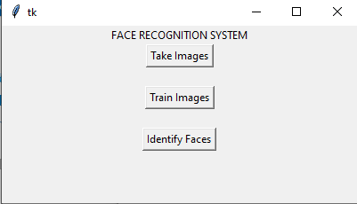

# Face_recognition_gui
It is a simple GUI based application to store, train and to recognize the faces.

## GUI Screenshot

## Steps to run the project:
1. Make sure you have Python installed( I used Python 3.6.5 for this project).
2. Clone this repository `https://github.com/jagdshmb/face_recognition_gui.git`
3. Open the `command prompt` in the downloaded repository directory.
4. Create a virtual environment `virtualenv env`
     - You need to have "virtualenv" python package already installed. If not install it. `pip install virtualenv`
5. Activate the virtual environment. `.\env\Scripts\activate`
6. Install all the required python packages. `pip install -r requirements.txt`
7. Run the `program.py` file.
8. GUI will get popped up.
9. Click on `Take Images` button to store faces.
10. Click on `Train Images` button to train the stored faces.
11. Click on `Identify Faces` button to recognize the faces.

## Text stack and Packages used:
1. Python (3.6.5)
2. Tkinter (UI)
3. OpenCV (Image processing)
4. HaarCascade (Face detection algorithm)
